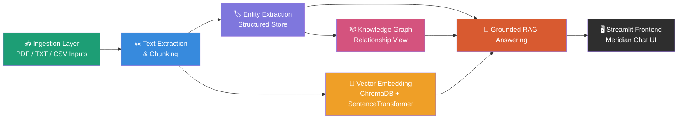

<div align="center">

# 🧪 Meridian

**An AI-powered pharmaceutical knowledge assistant that turns raw manufacturing and quality documentation into a searchable, explainable, and grounded retrieval system.**

[](https://www.python.org/)
[](https://streamlit.io/)
[](https://www.trychroma.com/)
[](https://www.sqlite.org/)
[](https://ai.google.dev/)
[](#)

*Ingest → Extract → Graph → Embed → Retrieve → Answer*

</div>

---

## 📋 Table of Contents

- [Problem Statement](#-problem-statement)
- [High-Level Pipeline](#-high-level-pipeline)
- [Project Architecture](#-project-architecture)
- [Pipeline Layers](#-pipeline-layers)
- [Retrieval Strategy](#-end-to-end-retrieval-strategy)
- [Tech Stack](#-tech-stack)
- [Quick Start](#-quick-start)
- [Key Outputs](#-key-outputs)
- [Why This Is a Strong Hackathon Project](#-why-this-is-a-strong-hackathon-project)
- [Future Enhancements](#-future-enhancements)

---

## 🎯 Problem Statement

Pharmaceutical operations rely on large volumes of technical records — SOPs, deviations, CAPAs, maintenance logs, and quality documents. These records are often scattered across formats and are difficult to search semantically or trace back to the right source.

**Meridian** solves this by connecting:

| | |
|---|---|
| 📥 | Raw document ingestion |
| 🏷️ | Structured entity extraction |
| 🕸️ | Graph-based relationship discovery |
| 🔎 | Semantic vector search |
| 💬 | Grounded Q&A with source-aware answers |

---

## 🔄 High-Level Pipeline



---

## 🏗️ Project Architecture

```text
meridian/
├── ingestion/               📥 Document ingestion and chunk preparation
│   ├── src/
│   ├── data/
│   └── output/
├── entity_extraction/       🏷️ Entity extraction + SQLite entity store
│   ├── src/
│   └── output/
├── knowledge_graph/         🕸️ Knowledge graph rendering and relationship visualization
│   ├── src/
│   └── output/
├── vector_embedding/        🔎 Semantic embedding store and retrieval pipeline
│   ├── src/
│   └── output/
└── frontend/                🖥️ Streamlit app for end-user experience
```

---

## 🧩 Pipeline Layers

<details open>
<summary><b>1️⃣ Ingestion Layer</b> — 📥 pulls in raw documents and prepares them for retrieval</summary>

<br>

**Responsibilities:**
- Extract text from source documents
- Normalize document structure
- Split content into semantic chunks
- Produce `chunks.json` as the shared input for downstream layers

📁 Folder: [`ingestion/`](ingestion/)

</details>

<details open>
<summary><b>2️⃣ Entity Extraction Layer</b> — 🏷️ converts chunks into structured, queryable facts</summary>

<br>

**Responsibilities:**
- Identify entities such as equipment, materials, operators, SOP references, and process steps
- Capture entity mentions with context snippets
- Persist structured knowledge in the SQLite entity store (`meridian.db`)
- Support direct SQL-style retrieval for audit-friendly grounded answers

📁 Folder: [`entity_extraction/`](entity_extraction/)

</details>

<details open>
<summary><b>3️⃣ Knowledge Graph Layer</b> — 🕸️ visualizes relationships between extracted entities</summary>

<br>

**Responsibilities:**
- Read relationships from the entity store
- Render an interactive graph for exploration
- Reveal structural links between equipment, materials, process steps, and compliance artifacts

📁 Folder: [`knowledge_graph/`](knowledge_graph/)

</details>

<details open>
<summary><b>4️⃣ Vector Embedding Layer</b> — 🔎 enables semantic search over chunked text</summary>

<br>

**Responsibilities:**
- Load the ingestion chunks
- Generate embeddings using Sentence Transformers
- Store embeddings in ChromaDB
- Retrieve the most relevant text chunks during question answering

📁 Folder: [`vector_embedding/`](vector_embedding/)

</details>

<details open>
<summary><b>5️⃣ Frontend Layer</b> — 🖥️ the polished, user-facing experience</summary>

<br>

**Responsibilities:**
- Accept natural language questions
- Retrieve supporting evidence from the end-to-end pipeline
- Generate grounded answers with source references
- Provide a clean, demo-ready experience for judges and users

📁 Folder: [`frontend/`](frontend/)

</details>

---

## 🔗 End-to-End Retrieval Strategy

Meridian uses a **hybrid context strategy** rather than relying on a single retrieval mode:

| Mode | Source | Contributes |
|---|---|---|
| 🔎 Vector retrieval | ChromaDB | Semantic matching |
| 🏷️ Entity store retrieval | SQLite | Factual mentions + context snippets |
| 🕸️ Graph relationship retrieval | Entity/relationship graph | Structural reasoning |

This blend improves answer quality by combining **semantic similarity**, **explicit entity facts**, and **relationship-aware context**.

---

## 🛠️ Tech Stack

<div align="left">


</div>

---

## 🚀 Quick Start

### 1. Install dependencies
```bash
pip install -r ingestion/requirements.txt
pip install -r vector_embedding/requirements.txt
```

### 2. Prepare the documents
Run the ingestion pipeline to create `chunks.json`.

### 3. Build the structured entity store
Load semantic chunks into the entity extraction pipeline so the SQLite database is populated.

### 4. Build the vector index
```bash
python vector_embedding/src/build_vector_store.py
```

### 5. Generate answers via the hybrid retrieval flow
```bash
python vector_embedding/src/generate_answer.py
```

### 6. Launch the frontend
```bash
streamlit run frontend/streamlit_app.py
```

> 💬 Ask a question through the Streamlit interface — the app retrieves context from the hybrid pipeline and sends the evidence to Gemini for answer generation.

---

## 📦 Key Outputs

| Output | Path |
|---|---|
| Chunked document text | `ingestion/output/chunks.json` |
| Structured entity store | `entity_extraction/output/meridian.db` |
| Interactive knowledge graph | `knowledge_graph/output/knowledge_graph.html` |
| Vector index | `vector_embedding/output/chroma_db/` |

---

## 🏆 Why This Is a Strong Hackathon Project

Meridian combines multiple AI and data engineering patterns into one end-to-end solution:

- ✅ Document ingestion and preprocessing
- ✅ Structured extraction
- ✅ Graph-based reasoning
- ✅ Semantic search
- ✅ Grounded answer generation
- ✅ User-facing product demo

It demonstrates both **technical depth** and **practical value** in a regulated manufacturing domain — built for a hackathon judge audience.

---

## 🔮 Future Enhancements

- [ ] Add a true hybrid router that ranks vector, entity, and graph evidence by query type
- [ ] Improve retrieval scoring and reranking
- [ ] Support multi-document summarization and traceability reporting
- [ ] Move to a production-grade API service with deployment support

---

<div align="center">

### 📝 Summary

**Meridian** is a full-stack knowledge retrieval and Q&A solution for pharmaceutical manufacturing records. It turns dispersed documentation into a structured, explainable, and searchable knowledge system with a clean demo interface.

</div>