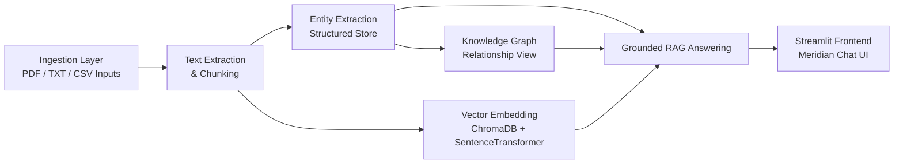

# Meridian

Meridian is an AI-powered pharmaceutical knowledge assistant that turns raw manufacturing and quality documentation into a searchable, explainable, and grounded retrieval system.

The project ingests source documents, extracts entities and relationships, builds a knowledge graph, creates semantic embeddings, and exposes the final system through a Streamlit chat interface for end users.

## Problem Statement

Pharmaceutical operations rely on large volumes of technical records, SOPs, deviations, CAPAs, maintenance logs, and quality documents. These records are often scattered across formats and are difficult to search semantically or trace back to the right source.

Meridian aims to solve that by building a retrieval pipeline that connects:

- raw document ingestion
- structured entity extraction
- graph-based relationship discovery
- semantic vector search
- grounded Q&A with source-aware answers

## High-Level Pipeline



## Project Architecture

```text
meridian/
├── ingestion/               # Document ingestion and chunk preparation
│   ├── src/
│   ├── data/
│   └── output/
├── entity_extraction/       # Entity extraction + SQLite entity store
│   ├── src/
│   └── output/
├── knowledge_graph/         # Knowledge graph rendering and relationship visualization
│   ├── src/
│   └── output/
├── vector_embedding/         # Semantic embedding store and retrieval pipeline
│   ├── src/
│   └── output/
└── frontend/                 # Streamlit app for end-user experience
```

## Pipeline Overview

### 1. Ingestion Layer

The ingestion layer is responsible for pulling in raw enterprise documents and preparing them for downstream retrieval.

Responsibilities:

- extract text from source documents
- normalize document structure
- split content into semantic chunks
- produce `chunks.json` as the shared input for the downstream layers

Primary folder:

- [ingestion/](ingestion/)

### 2. Entity Extraction Layer

This layer converts document chunks into structured entities and relationships and stores them in SQLite.

Responsibilities:

- identify entities such as equipment, materials, operators, SOP references, and process steps
- capture entity mentions with context snippets
- persist the structured knowledge in the SQLite entity store (`meridian.db`)
- support direct SQL-style retrieval for audit-friendly grounded answers

Primary folder:

- [entity_extraction/](entity_extraction/)

### 3. Knowledge Graph Layer

The knowledge graph layer visualizes relationships between extracted entities.

Responsibilities:

- read relationships from the entity store
- render an interactive graph for exploration
- reveal structural links between equipment, materials, process steps, and compliance artifacts

Primary folder:

- [knowledge_graph/](knowledge_graph/)

### 4. Vector Embedding Layer

This layer creates a semantic searchable vector index over the chunked text.

Responsibilities:

- load the ingestion chunks
- generate embeddings using Sentence Transformers
- store embeddings in ChromaDB
- retrieve most relevant text chunks during question answering

Primary folder:

- [vector_embedding/](vector_embedding/)

### 5. Frontend Layer

The frontend is a polished user-facing Streamlit application.

Responsibilities:

- accept natural language questions
- retrieve supporting evidence from the end-to-end pipeline
- generate grounded answers with source references
- provide a clean, demo-ready experience for judges and users

Primary folder:

- [frontend/](frontend/)

## End-to-End Retrieval Strategy

Meridian uses a hybrid context strategy rather than relying on a single retrieval mode.

The answer-generation pipeline combines:

1. Vector retrieval from ChromaDB for semantic matching
2. Entity store retrieval from the SQLite database for factual mentions and context snippets
3. Graph relationship retrieval from the entity/relationship graph for structural reasoning

This hybrid approach improves the quality of answers because it blends:

- semantic similarity
- explicit entity facts
- relationship-aware context

## Tech Stack

- Python
- Streamlit
- SQLite
- ChromaDB
- Sentence Transformers
- Google Gemini API
- PyVis for knowledge graph rendering

## Typical Workflow

### Step 1 — Prepare the documents

Run the ingestion pipeline to create `chunks.json`.

### Step 2 — Create the structured entity store

Load semantic chunks into the entity extraction pipeline so that the SQLite database is populated.

### Step 3 — Build the vector index

Generate embeddings and store them in the local ChromaDB vector store.

### Step 4 — Query the system

Ask a question through the Streamlit interface. The app retrieves context from the hybrid pipeline and sends the evidence to Gemini for answer generation.

## Key Outputs

- `ingestion/output/chunks.json`
- `entity_extraction/output/meridian.db`
- `knowledge_graph/output/knowledge_graph.html`
- `vector_embedding/output/chroma_db/`

## How to Run

### Install dependencies

```bash
pip install -r ingestion/requirements.txt
pip install -r vector_embedding/requirements.txt
```

### Start the frontend

```bash
streamlit run frontend/streamlit_app.py
```

### Build the vector store

```bash
python vector_embedding/src/build_vector_store.py
```

### Generate answers using the hybrid retrieval flow

```bash
python vector_embedding/src/generate_answer.py
```

## Why This Is a Strong Hackathon Project

Meridian is compelling because it combines multiple AI and data engineering patterns into one end-to-end solution:

- document ingestion and preprocessing
- structured extraction
- graph-based reasoning
- semantic search
- grounded answer generation
- user-facing product demo

The project demonstrates both technical depth and practical value in a regulated manufacturing domain, making it suitable for a hackathon judge audience.

## Future Enhancements

- add a true hybrid router that ranks vector, entity, and graph evidence by query type
- improve retrieval scoring and reranking
- support multi-document summarization and traceability reporting
- move the system to a production-grade API service with deployment support

## Summary

Meridian is a full-stack knowledge retrieval and Q&A solution for pharmaceutical manufacturing records. It turns dispersed documentation into a structured, explainable, and searchable knowledge system with a clean demo interface.
